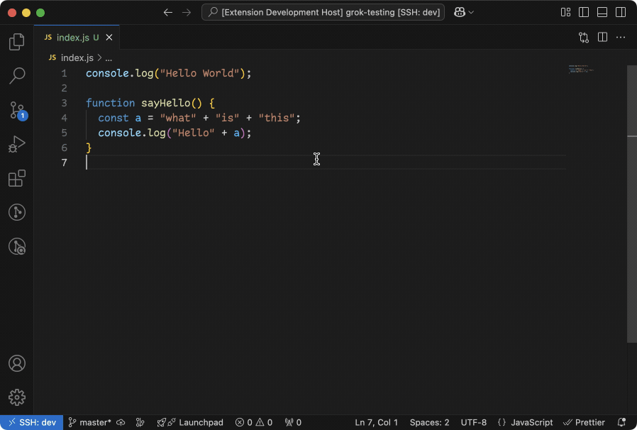

# Simply Grok for VSCode

This extension enables you to easily ask Grok any question about your source code directly from within VSCode via [xAI API](https://x.ai/api).

## Disclaimer

Simply Grok for VSCode integrates with the xAI API to provide its functionality. Please note that usage of the xAI API may incur costs depending on your subscription plan with xAI. Users are responsible for any fees charged by xAI for API access. Review [xAI's pricing](https://docs.x.ai/docs/models) details to understand potential costs before using this extension. This extension is independently developed and is in no way affiliated with or endorsed by xAI.

## Demo

## Installation

1. Open VS Code
2. Go to the Extensions view
3. Search for "Simply Grok for VSCode"
4. Click Install

## Usage

1. Open a project in VS Code
2. Press `Ctrl+Shift+P` to open the command palette
3. Type "Ask Grok" and select the command
4. Enter your xAI API key and question when prompted

### Models

The default model is `grok-2`, but you can easily switch to another model through the **Settings** menu. Navigate to **Settings**, search for **Grok**, and update the **Model** field to your preferred option.

#### Supported Grok Models
The following models are currently available:
- `grok-3-fast`: Optimized for speed with high performance.
- `grok-3-mini-fast`: A compact, high-speed model for lightweight tasks.
- `grok-3-mini`: A smaller model for efficient processing.
- `grok-3`: A powerful model for complex tasks.
- `grok-2-vision`: Supports vision-based inputs alongside text.
- `grok-2` (default): A versatile, general-purpose model.
- `grok-vision-beta`: An experimental model for vision and text processing.
- `grok-beta`: An early-access model for testing new features.

For more details on each model, refer to the [Grok Models Documentation](https://docs.x.ai/docs/models).

### Commands

The following commands bring Grok right into your coding world, letting you zoom out to the whole project, zoom in on a file, or pinpoint a function—all without breaking your flow in VS Code!

#### Ask Grok: Workspace

This command lets you ask Grok about your entire project in Visual Studio Code. Imagine you’re working on a big coding puzzle—select this, and Grok will look at all your files and help you with questions like “What’s going on in my project?” or “Can you find something across my code?” It’s like giving Grok a map of your whole workspace to explore and assist with!

#### Ask Grok: Current Tab

Focus on just one file? This command has you covered. Open a file, run this, and Grok will dive into whatever’s on your current tab. Ask stuff like “What does this file do?” or “How can I fix this part?” It’s like handing Grok a single page of your notebook and getting tailored help for it.

#### Ask Grok: Function Under Cursor

Ever stare at a function and think, “Huh, what’s this doing?” Place your cursor on a function, use this command, and Grok will explain it or offer tips. It’s like pointing at a specific gadget in your code and having Grok say, “Oh, here’s how that works!”—super handy for quick clarity.

#### Ask Grok: Selected Text

Allows users to ask Grok a question about the currently selected text in the active tab of Visual Studio Code. This command leverages Grok's capabilities to provide insights, explanations, or answers based on the highlighted text.

### Preview

The `"vscodeGrok.showPreview"` setting in VS Code lets you decide when to see a sneak peek of the data being sent to the Grok API before it goes out. You can set it to `"always"` to preview every request, `"workspace-only"` to only see it for big projects involving your whole workspace (the default choice), or `"never"` to skip it entirely. When a preview pops up, it shows the data in a little window with "Send" and "Cancel" buttons, so you can double-check and either approve or stop it—handy for catching mistakes or keeping things private, all while keeping your workflow smooth.

## Contribute

Love using the Simply Grok for VSCode to supercharge your coding with Grok’s smarts? We’d love for you to jump in and help make it even better! Whether you’re a pro at VS Code extensions, a wizard with ideas, or just excited to tweak something small, your contribution could make a big difference.

Here’s how you can get involved:

- **Share Ideas**: Got a feature in mind? Drop it in the [Issues](https://github.com/eriktodx/vscode-grok/issues) section!
- **Fix or Add Stuff**: Feel like coding? Fork the repo, make your magic, and send us a [Pull Request](https://github.com/eriktodx/vscode-grok/pulls).
- **Spread the Word**: Tell your friends about Simply Grok for VSCode — more users, more fun!
